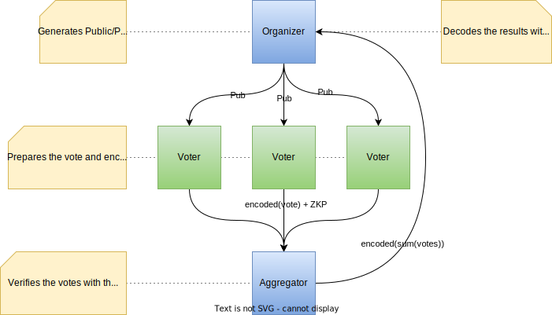

<p align="center">
<h1>Privacy Preserving Voting System using Partial Homomorphic Encryption</h1>
</p>

# Introduction

I will introduce a voting system utilizing Partial Homomorphic Encryption to preserve full voting privacy.
The main goal was to create a voting system where the identity and the vote of the voters remain hidden from anyone in the network. The suggested system relies on partial homomorhpic encryption in order to collect and process all the votes preserving their privacy. I used Paillier cryptosystem but similar results could be achieved with ElGamal for example. Even though the proposed system targets voting it can be used for other purposes such quizes or surveys.
The system is designed for both server and client side thus making it suitable for decentralized systems such as blockchain based.

## Installation

```bash
npm install @cryptovarna/phe-voting-js
```

or

```bash
yarn add @cryptovarna/phe-voting-js
```

1. [General Flow](#general-flow)
1. [Vote Encoding](#vote-encoding)
1. [Paillier Cryptosystem](#paillier-cryptosystem)
1. [The Final Solution](#the-final-solution)

# General Flow

<p align="center">
  
</p>

The process here for each role is:

### Organizer

The party that is organizing the ballot. It has the responsibility to generate a secure public/private key pair and to share the public part to all participants and aggregators.
The organizer is the only one that can see the results. That's why it is important to separate vote collection from it.
When all the votes are aggregated by the aggregator they will be submitted in an encrypted form to the Organizer where they will be decrypted using its private key.
Then the Organizer can finally announce the results.

### Voter

Voters use software to prepare and cast their votes. The software reasds the rules for the ballot - candidates, public key etc. Then the voter chooses a candidate and encodes and encrypts the choice using the Organizer's public key. Then the vote is cast to the Aggregator.

### Aggregator

Aggregator (one ore more) are collecting all votes from the voters. First they need to validate the vote using the zero-knowledge proof provided by the voter. In this way they can see if the vote (selected candidate) is one of the valid candidates without being able to see which one exactly. If correct the vote is aggregated with all other votes and stored. When all votes are done the result is sent to the Organizer. It is important to mention that the Aggregators and the Organizer must be independent from each other otherwise the Aggregators can read the user vote.

In the next chapters we will see how to implement that process.

# Vote Encoding

Let's have 3 candidates - Alice, Bob and Carlos. We assign a number to each candidade, starting from 0 - Alice, 1 - Bob and 2 Carlos.
We'd like to encode the votes into a single integer in order to be able to perform arithmetic operations over it and to encrypt it with the Paillier cryptosystem.

<p align="center">
    
</p>

We reserve 8 bits for each candidate and since we have 3 candidates we get 3 times by 8 bits in total. So each 8 bit space in our integer (of total 24 bits) will contain the votes cast for each corresponding candidate. The first voter cast a vote for Alice. So we count 1 in the Alice's bit space.

<p align="center">
    
</p>

The second one votes for Carlos so we add 1 in the Carlos's space. This of course can be achieved using 3 8 bit unsigned integers but to optimize it we can use a single one and just add

\(2^{numberOfBitsPerVote \times candidateId} = 2^{8 \times 2} = 2^{16} = 65536\)
or \(1 << (numberOfBitsPerVote \times candidateId)\)

<p align="center">
    
</p>

The third one votes for Alice again. So at the end we have 2 votes for Alice, no votes for Bob and a single vote for Carlos.

<p align="center">
    
</p>

At this point we have the sum of all votes for each candidate encoded into this 24 bit integer. Its value is \( 2 + (1 << 16) = 65538 \).

<p align="center">
    
</p>

## Usage

```typescript
import { VoteEncoder } from "phe-voting-js";
```

### Encode a Single Choice Vote

```typescript
// 0 - Alice, 1 - Bob, 2 - Carlos
const numChoices = 3;
const choice = 1; // Bob
const bitsPerChoice = 8;
const encoded = VoteEncoder.encodeSingle(choice, numChoices, bitsPerChoice);
// encoded = 256
const decoded = VoteEncoder.decode(encoded, numChoices, bitsPerChoice);
// deceded = [0, 1, 0]
```

### Encode a Multiple Choice Vote

```typescript
// 0 - Alice, 1 - Bob, 2 - Carlos
const numChoices = 3;
const choices = [0, 1]; // Alice and Bob
const bitsPerChoice = 8;
const encoded = VoteEncoder.еncodeMultiple(choice, numChoices, bitsPerChoice);
// encoded = 257
const decoded = VoteEncoder.decode(encoded, numChoices, bitsPerChoice);
// deceded = [1, 1, 0]
```

# Paillier Cryptosystem

Partial homomorphic encryption is a type of encryption scheme that supports computation on encrypted data without fully revealing the plaintext. It enables specific mathematical operations, such as addition or multiplication, to be performed on encrypted values while maintaining confidentiality. While not as versatile as fully homomorphic encryption, which supports arbitrary computations, partial homomorphic encryption offers a balance between privacy and computation capabilities, making it useful in scenarios where limited calculations on encrypted data are required.
The algorithm used here is the Paillier cryptosystem named after its creator - Pascal Paillier.

**DISCLAIMER: The following is a naïve Paillier cryptosystem implementation and is unaudited. It should not be used for security-critical applications.**

## Usage

```typescript
import { Paillier, PrivateKey, PublicKey, Signature, ZkpCommitment, bigInt } from "phe-voting-js";
```

### Generating Key Pair

```typescript
const [pub, priv]: [PublicKey, PrivateKey] = Paillier.generateKeyPair(256);
```

For real secure scenarios use key sizes of 3072 bits, 4096 bits or more. See [here](https://www.keylength.com/en/4/) for more info.

### Encryption

```typescript
const plainMessage = bigInt(12345);
const encryptedMessage = Paillier.encrypt(plainMessage, pub);
```

### Decryption

```typescript
const decryptedMessage = Paillier.decrypt(encryptedMessage, pub, priv);
// decryptedMessage = 12345
```

### Addition of Encrypted Numbers

```typescript
const a = bigInt(1);
const b = bigInt(2);
const aEncrypted = Paillier.encrypt(a, pub);
const bEncrypted = Paillier.encrypt(b, pub);
const sumEncrypted = Paillier.addEncrypted(aEncrypted, bEncrypted, pub);
const sum = Paillier.decrypt(sumEncrypted, pub, priv);
// sum = 3
```

### Addition of Encrypted and Scalar

```typescript
const a = bigInt(1);
const b = bigInt(2);
const aEncrypted = Paillier.encrypt(a, pub);
const sumEncrypted = Paillier.addScalar(aEncrypted, b, pub);
const sum = Paillier.decrypt(sumEncrypted, pub, priv);
// sum = 3
```

### Multiplication of Encrypted and Scalar

```typescript
const a = bigInt(2);
const b = bigInt(5);
const aEncrypted = Paillier.encrypt(a, pub);
const prodEncrypted = Paillier.mulScalar(aEncrypted, b, pub);
const prod = Paillier.decrypt(prodEncrypted, pub, priv);
// prod = 10
```

### Signing and Verifying

```typescript
const m = bigInt(12345);
const sig = Paillier.createSignature(m, pub, priv);
// Send m and sig to the corresponding party
const valid = Paillier.verifySignature(m, sig, pub);
// valid should be true
```

### Encrypting with Zero-Knowledge Proof

```typescript
const m = bigInt(12345);
const valid = [bigInt(1), bigInt(12345)];
const invalid = [bigInt(1), bigInt(2)];
const [c, commitment]: [BigInteger, ZkpCommitment] = Paillier.encryptWithZkp(m, valid, pub);
Paillier.verifyZkp(c, valid, commitment, pub); // true
Paillier.verifyZkp(c, invalid, commitment, pub); // false
```

# The Final Solution

```typescript
import { bigInt, Paillier, PrivateKey, PublicKey, VoteEncoder } from "phe-voting-js";

const numChoices = 3;
const bitsPerChoice = 8;
const numVotes = 99;

// *****************
// *** Organizer ***
// *****************
const [pub, priv]: [PublicKey, PrivateKey] = Paillier.generateKeyPair(160);
const validVotes = VoteEncoder.getSingleChoicePermutations(numChoices, bitsPerChoice);
const realVotes = new Array<number>(validVotes.length).fill(0);

let encryptedSum = Paillier.encrypt(bigInt.zero, pub);

for (let i = 0; i < numVotes; i++) {
    // *************
    // *** Voter ***
    // *************
    // Choose one of the candidates
    let vote = i % numChoices;
    // Encode vote
    const encodedVote = VoteEncoder.encodeSingle(vote, numChoices, bitsPerChoice);
    // Encrypt vote
    const [encryptedVote, commitment] = Paillier.encryptWithZkp(encodedVote, validVotes, pub);

    // ******************
    // *** Aggregator ***
    // ******************
    // Check vote validity
    const valid = Paillier.verifyZkp(encryptedVote, validVotes, commitment, pub);
    if (!valid) throw new Error("Invalid vote");
    // Aggregate votes
    realVotes[vote]++;
    encryptedSum = Paillier.addEncrypted(encryptedSum, encryptedVote, pub);
}

// *****************
// *** Organizer ***
// *****************
const decryptedSum = Paillier.decrypt(encryptedSum, pub, priv);
const decodedSum = VoteEncoder.decode(decryptedSum, numChoices, bitsPerChoice);
// decodedSum = [33, 33, 33]
```

# Further Developments

Even though the proposed system can be used there are some additions that can be made to improve its security.

### Hiding voter's identity from the Aggregator

If the voter communicates directly with the Aggregator using software connected to internet then at least the IP address of the voter can be seen by the aggregator thus lowering the privacy of the voter. This can be secured in different ways one of which is using an Onion Router such as [Tor](<https://en.wikipedia.org/wiki/Tor_(network)>) or similar network.

### Decentralization

If we introduce the blockchain techologies into the voting system we can achieve much higher level of privacy and independancy. For example all ballots can be announced on chain along with the public key of the organizer. Everyone can see this information and no connection to the organizer will be required.
Aggregators could be anyone following the protocol. At the end all aggregators can deposit partial results on chain and since they are encrypted no one excepts the organizer can see them.

# References

-   [Paillier Cryptosystem - Wiki](https://en.wikipedia.org/wiki/Paillier_cryptosystem)
-   [Paillier Cryptosystem - Original Paper](https://www.cs.tau.ac.il/~fiat/crypt07/papers/Pai99pai.pdf)
-   [Zero-Knowledge Proof in Paillier Cryptosystem](https://paillier.daylightingsociety.org/Paillier_Zero_Knowledge_Proof.pdf)
